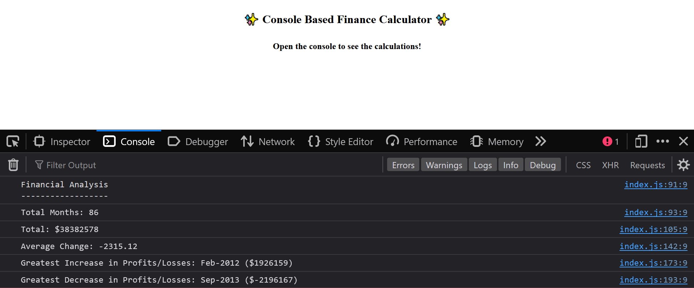

# Console Finance Calculator
Repository for a Console Based Finance Calculator written in JavaScript and HTML.

## Description

Being able to make precise calculations is imperative when working with numbers and more importantly, finances. That's why I've developed this application, which precisely calculates figures from a dataset.

The aim of this project was to take a pre-existing dataset and make the following calculations and display them in the console:

- The total number of months included in the dataset.
- The net total amount of Profit/Losses over the entire period.
- The average of the changes in Profit/Losses over the entire period.
- The greatest increase in Profit/Losses (date and difference in the amounts) over the entire period.
- The greatest decrease in Profit/Losses (date and difference in the amounts) over the entire period.

The motivation behind this project was to test my skills in what would be a real-world task, whilst making sure I understood the code aswell as the calculations the code was executing.

The problem was, all of the data was readily available but would have had to be calculated manually to reach the desired result which would have taken a great amount of time. The solution to this problem was building an application in JavaScript which would iterate through the initial dataset array and then run through different calculations, saving the results for each calculation and displaying these in the console, saving time and potential miscalculation.

## Table of Contents

- [Description](#description)
- [Installation](#installation)
- [Credits](#credits)
- [License](#license)

## Installation

N/A

## Usage

A basic JavaScript based finance calculator app - view <a href="https://reececorkhill.github.io/Console-Finances/"> here</a>.

## Credits

Console Finance Calculator was developed by <a href="https://github.com/reececorkhill">reececorkhill</a>.

## License

MIT License

Copyright (c) 2023 reececorkhill

Permission is hereby granted, free of charge, to any person obtaining a copy
of this software and associated documentation files (the "Software"), to deal
in the Software without restriction, including without limitation the rights
to use, copy, modify, merge, publish, distribute, sublicense, and/or sell
copies of the Software, and to permit persons to whom the Software is
furnished to do so, subject to the following conditions:

The above copyright notice and this permission notice shall be included in all
copies or substantial portions of the Software.

THE SOFTWARE IS PROVIDED "AS IS", WITHOUT WARRANTY OF ANY KIND, EXPRESS OR
IMPLIED, INCLUDING BUT NOT LIMITED TO THE WARRANTIES OF MERCHANTABILITY,
FITNESS FOR A PARTICULAR PURPOSE AND NONINFRINGEMENT. IN NO EVENT SHALL THE
AUTHORS OR COPYRIGHT HOLDERS BE LIABLE FOR ANY CLAIM, DAMAGES OR OTHER
LIABILITY, WHETHER IN AN ACTION OF CONTRACT, TORT OR OTHERWISE, ARISING FROM,
OUT OF OR IN CONNECTION WITH THE SOFTWARE OR THE USE OR OTHER DEALINGS IN THE
SOFTWARE.
